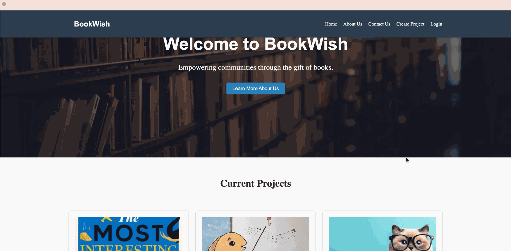
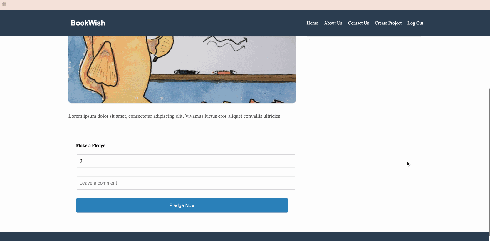

# 📚 BookWish - React Crowdfunding Frontend Project

## 🌐 Deployed Link

A link to the deployed front-end  [BookWish](https://bookwish-crowdfunding.netlify.app)

## ⚙️ Installation

1. Clone the repository
   ```
   git clone https://github.com/AbbyKuo/crowdfunding-frontend.git
   ```
2. Navigate to the project directory
   ```
   cd crowdfunding
   ```
3. Run `npm install` to install the dependencies
   ```
   npm install
   ```
4. Run `npm run dev` to start the development server
   ```
   npm run dev
   ```

## 🎯 What the Project is About

1. Navigate to the deployed front-end link
2. Sign up or log in to the platform
3. Explore the current projects and make a contribution
4. Track the progress of your contribution and the impact it's making

## 🎓 What I Learnt

### 🖥️ Frontend Development
- Built a responsive React application using modern Javascript and component architecture
- Implemented user authentication with login/signup functionality
- Created reusable components (Hero, ProjectCard, Forms) with organised, maintainable code
- Styled components using modern CSS techniques (Flexbox, Grid) for a polished interface

### 🔄 State & Data Management
- Managed application state using React Hooks (useState) and Context API
- Created custom hooks for authentication and data fetching
- Integrated with REST API endpoints for data operations
- Handled loading states and error boundaries for better user experience

### 🔌 Backend Integration
- Connected React frontend with Django REST Framework backend
- Implemented secure user authentication with JWT tokens
- Configured CORS for secure cross-origin communication
- Organised environment variables and API configurations

### 🛠️ Development Tools & Best Practices
- Utilised Git for version control and project management
- Set up development environment with Vite
- Followed React best practices and component lifecycle patterns
- Implemented responsive design for mobile and desktop views

## 🚀 Future Improvements

### 📋 Project Features
- Enable project owners to edit and manage their projects
- Add project categorisation and search function
- Implement project progress tracking and updates
- Add automated email notifications for project milestones

### 👤 User Experience
- Add user profile management and customisation
- Create user dashboard for tracking contributions
- Implement password recovery system
- Add social media authentication options

### 🎨 Interface Enhancements
- Optimise mobile responsiveness
- Add smooth transitions and loading states
- Implement dark/light theme toggle
- Add image upload for projects and profiles

### ⚡ Technical Upgrades
- Enhance security with two-factor authentication
- Improve error handling and user feedback
- Add automated testing
- Implement real-time updates for project status

### 🤝 Community Features
- Add comment system for project feedback
- Create project rating system
- Enable direct messaging between users
- Implement project sharing on social media

## 📸 Screenshots

### Home Page



### Project Creation Page


### Pledge Creation Form



### Project with Pledges


### Unauthorised User Attempt to Pledge to Project


### User Dashboard

